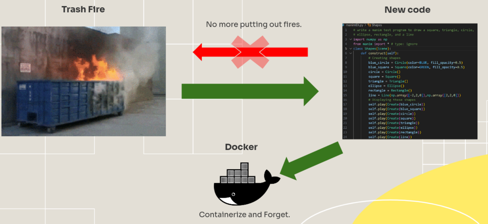

<!DOCTYPE html>
<html lang="en">
<head>
  <meta charset="UTF-8" />
  <title>Amscope-Docker</title>
  <meta name="viewport" content="width=device-width, initial-scale=1" />
</head>
<body>

<!-- Improved compatibility of back to top link -->

<!-- Shields -->

  
  
  
  
  

<!-- Project Title -->

  
  <h3 align="center">Amscope-Docker</h3>
  

    Containerized <strong>FastAPI</strong> back-end (and optional <strong>PyQt6</strong> GUI) for an <em>AmScope USB microscope camera</em> – demonstrating how the TDC001-Docker template can be re-purposed for a different lab instrument. 
    <a href="https://github.com/JacobGitz/Amscope-Docker/issues">Report Bug</a>
    &middot;
    <a href="https://github.com/JacobGitz/Amscope-Docker/issues">Request Feature</a>
  

<!-- TOC -->
<h2>📑 Table of Contents</h2>
<ul>
  <li><a href="#about-the-project">About The Project</a></li>
  <li><a href="#built-with">Built With</a></li>
  <li><a href="#getting-started">Getting Started</a></li>
  <li><a href="#usage">Usage</a></li>
  <li><a href="#screenshots">Screenshots</a></li>
  <li><a href="#roadmap">Roadmap</a></li>
  <li><a href="#troubleshooting">Troubleshooting</a></li>
  <li><a href="#development-repurposing">Development &amp; Repurposing</a></li>
  <li><a href="#contributing">Contributing</a></li>
  <li><a href="#license">License</a></li>
  <li><a href="#contact">Contact</a></li>
</ul>

<!-- ABOUT -->
<h2 id="about-the-project">📦 About The Project</h2>

Our goal is a drop-in control stack that can be cloned, rebuilt, and reused for any instrument interface in the laboratory. Each device follows the same flexible pattern: a lean FastAPI container that communicates with the USB hardware, and (optionally) a lightweight PyQt6 GUI container streamed through noVNC for visualization. By swapping out the driver module and UI, you can command a motorized stage today, a camera tomorrow, or whatever hardware comes next – without worrying that new code will eventually break.

This repository is a variant of the original <code>TDC001-Docker</code> project, now targeting an <strong>AmScope microscope camera</strong> instead of the Thorlabs stepper controller. Starting with the <code>dev</code> branch (2025-08 release), the implementation focuses on the camera and typically runs as a single Docker service (back-end API). In the original two-container design, we had:   <strong>Backend (FastAPI)</strong> – a REST API (on port <code>8000</code>) that controls any attached device (stepper or camera).  <strong>Frontend (PyQt6 GUI)</strong> – a desktop-style UI streamed via noVNC (on port <code>6080</code>) for interactive control.

For the camera use-case, the GUI component is not included – you can use the system headlessly via the API. Linux hosts can access the USB camera natively (Docker Native); Windows hosts can use WSL2 + Docker Desktop and usbipd-win/GUI for USB device binding; macOS can run the API container, but USB passthrough on Mac is not yet solved (you would need to run the actual camera interface on a separate Linux/Windows machine).

<strong>Relevant documentation:</strong> 
- The AmScope camera driver and SDK (low-level API for the microscope camera) 
- “How To Docker #1” – an introductory slide deck covering Docker usage (a PDF copy is provided in the <code>Documentation/</code> folder). <a href="https://docs.google.com/presentation/d/1g8y-PXOg5V4Ve93i1UUEbFeU9zlJ3SWcqfPgaKH4Flg/edit?usp=sharing" target="_blank" rel="noopener noreferrer">View the presentation slides</a>. 
- Readme.txt files present in each directory  
- Kai's original repo on the Duttlab organization (also inside this repo in the /Code directory)  

<!-- BUILT WITH -->
<h2 id="built-with">🔧 Built With</h2>
<ul>
  <li>Python 3.13 (Docker slim base image)</li>
  <li>FastAPI + Uvicorn (backend REST API framework)</li>
  <li>Docker &amp; Docker Compose v2</li>
  <li><code>libamcam</code> SDK library (native driver for the AmScope/ToupTek camera, accessed via Python ctypes)</li>
  <li><code>usbipd-win</code> (USB ↔ WSL2 passthrough on Windows hosts)</li>
</ul>

<!-- GETTING STARTED -->
<h2 id="getting-started">🧪 Getting Started</h2>

<h3>Windows (WSL2) + Docker Desktop Setup</h3>
<ol>
  <li>
    (Required) Download and install <a href="https://www.docker.com/products/docker-desktop/" target="_blank" rel="noopener noreferrer">Docker Desktop</a> for Windows. During installation, enable the option for WSL2 integration.
  </li>
   
  <li>
    (Optional) Open PowerShell or CMD as Administrator and install a Linux distribution for WSL2 (Fedora 42 is tested, but other distros can work as well):
    <pre><code>wsl --install -d FedoraLinux-42</code></pre>
  </li>
   
  <li>
    (Optional) After installation, enable the distro in Docker Desktop: go to <strong>Settings &rarr; Resources &rarr; WSL Integration</strong> and ensure your WSL distro (e.g., <code>FedoraLinux-42</code>) is enabled.
  </li>
   
  <li>
    (Optional) Set the new distro as the default for WSL2:
    <pre><code>wsl --set-default FedoraLinux-42</code></pre>
    Now, running <code>wsl</code> with no arguments will drop you into the Fedora WSL shell by default. (Type <code>exit</code> to leave the WSL shell.)
  </li>
   
  <li>
    (Optional) Install <a href="https://github.com/dorssel/usbipd-win" target="_blank" rel="noopener noreferrer">usbipd-win</a> to enable USB passthrough. Then, from an elevated PowerShell or CMD, enumerate and bind the camera’s USB device to WSL:
    <pre><code>usbipd list
usbipd wsl bind --busid &lt;BUS-ID&gt;
# If needed on some systems:
usbipd wsl attach --busid &lt;BUS-ID&gt;</code></pre>
  </li>
   
  <li>
    (Required) Install a GUI helper for USB/IP such as <a href="https://gitlab.com/alelec/wsl-usb-gui" target="_blank" rel="noopener noreferrer">WSL-USB-GUI</a> to easily manage USB device attachments and auto-attach on boot. (Installer included in Prereqs/Windows)
  </li>
</ol>

<h3 id="fork-and-clone">Fork &amp; Clone Repository and Launch Application</h3>

<!-- GitHub Desktop path (easiest) -->
<h4 id="desktop-easiest">Use GitHub Desktop (easiest)</h4>

<em>GitHub Desktop is easier than running git commands on the terminal.</em>

<ol>
  <li>
    Install GitHub Desktop: <a href="https://desktop.github.com/" target="_blank" rel="noopener noreferrer">desktop.github.com</a>.
  </li>
   
  <li>
    Sign in to your GitHub account in GitHub Desktop (File → Options → Accounts).
  </li>
   
  <li>
    Fork the repository on the GitHub website by clicking the <strong>Fork</strong> button at the top of the repo page (this creates a copy under your account).
  </li>
   
  <li>
    In GitHub Desktop: <strong>File → Clone Repository…</strong> → <em>GitHub.com</em> tab → select your fork of <code>Amscope-Docker</code> → <strong>Clone</strong>.
  </li>
   
  <li>
    (Optional) Keep your fork up to date: in GitHub Desktop, click <strong>Fetch origin</strong>, then use <strong>Branch → Merge into current branch…</strong> if you maintain an <code>upstream</code> remote.
  </li>
   
  <li>
    Open the project folder in your file manager (see <a href="#launching">Launching</a> below).
  </li>
</ol>

<!-- Launching -->
<h4 id="launching">Launching the back-end (API) container (I suggest you read the readme.txt in the OS directory first!)</h4>
<ol>
  <li>
    <strong>(For devs) Using Docker Compose:</strong>
    <pre><code>docker compose up --build</code></pre>
  </li>
   
  <li>
    <strong>(For users) Using provided scripts:</strong> In the <code>OS/</code> directory, there is a cross-platform launch script (you can either double click it or open cmd in the directory and run the below command):
    <pre><code>python launch.py</code></pre>
  </li>
   
  <li>
    Once the backend is running, open your web browser to access the interface:
    <ul>
      <li><strong>API Documentation</strong> – navigate to <code>http://&lt;your-ip&gt;:assigned-device-port/docs</code> to view the interactive FastAPI Swagger UI. (should automatically open)</li>
    </ul>
  </li>
</ol>

<!-- USAGE -->
<h2 id="usage">🚀 Usage</h2>

Once your container (or local server) is up and running, you can interact with the microscope camera through the provided API endpoints.

<h3>Web API (FastAPI backend)</h3>

Use a web browser or any HTTP client to interact with the camera’s REST API. The interactive docs at <code>http://localhost:8000/docs</code> list all endpoints and let you try them out.

<!-- SCREENSHOTS placeholder (optional) -->
<h2 id="screenshots">🖼️ Screenshots</h2>

Coming soon.

<!-- ROADMAP -->
<h2 id="roadmap">🗺️ Roadmap</h2>
<ul>
  <li>[x] Containerized camera backend (FastAPI API for image capture)</li>
  <li>[x] Cross-platform support (Linux &amp; WSL; basic Windows native compatibility)</li>
  <li>[ ] Live stream support (continuous video feed endpoint or viewer)</li>
  <li>[ ] Optional GUI front-end for live preview and manual control (e.g., PyQt6 or web-based UI)</li>
  <li>[ ] Cross-platform installer or packaged release (one-click install for end-users, bundling the appropriate camera driver for each OS)</li>
  <li>[ ] macOS support for camera (testing with <code>libamcam.dylib</code> once USB access is resolved)</li>
  <li>[ ] Integration with third-party analysis software (e.g., pipeline data from the camera API into image analysis tools)</li>
</ul>

<!-- TROUBLESHOOTING -->
<h2 id="troubleshooting">🧠 Troubleshooting</h2>
<table border="1">
  <tr>
    <th>Problem</th>
    <th>Solution / Advice</th>
  </tr>
  <tr>
    <td>Backend doesn’t detect the camera device</td>
    <td>
      <ul>
        <li><strong>Windows (WSL2):</strong> Ensure you have bound the USB device in <code>usbipd</code> (see Getting Started step 5).</li>
        <li><strong>Windows (native):</strong> Make sure <code>amcam.dll</code> is present and the Python code can load it.</li>
        <li><strong>Linux:</strong> If using Docker, run the container with <code>--privileged</code>.</li>
      </ul>
    </td>
  </tr>
  <tr>
    <td>API is running but <code>/capture</code> returns errors or no image</td>
    <td>
      <ul>
        <li>Check the logs of the backend (if in Docker, <code>docker logs &lt;container&gt;</code>).</li>
        <li>Ensure the camera is not in use by another program.</li>
        <li>If the image appears black, adjust exposure time.</li>
      </ul>
    </td>
  </tr>
  <tr>
    <td>Cannot load <code>libamcam.so</code> or <code>amcam.dll</code></td>
    <td>
      <ul>
        <li><strong>Linux:</strong> The file <code>OS/libamcam.so</code> must be present and compiled for your platform.</li>
        <li><strong>Windows:</strong> You need <code>amcam.dll</code>.</li>
        <li><strong>macOS:</strong> macOS is not supported yet for camera integration.</li>
      </ul>
    </td>
  </tr>
</table>

<!-- DEVELOPMENT & REPURPOSING -->
<h2 id="development-repurposing">🧰 Development &amp; Repurposing</h2>

<strong>Project Structure:</strong> The code is organized to separate hardware interaction from the API logic.

<!-- CONTRIBUTING -->
<h2 id="contributing">🤝 Contributing</h2>
<ol>
  <li>Fork the project repository by clicking the “Fork” button on GitHub.</li>
  <li>Clone your fork (see <a href="#desktop-easiest">GitHub Desktop (easiest)</a> or <a href="#cli-advanced">Git (advanced)</a> instructions above).</li>
  <li>Create a new branch for your feature or fix:</li>
  <li>Make your changes, and commit with a clear message.</li>
  <li>Push the branch to your GitHub fork.</li>
  <li>Open a Pull Request on the original repository.</li>
</ol>

<!-- LICENSE -->
<h2 id="license">📜 License</h2>

This project is distributed under the GNU General Public License (GPL-3.0). See the <code>LICENSE</code> file for details.

<!-- CONTACT -->
<h2 id="contact">📬 Contact</h2>

Jacob Lazarchik – Creator and Maintainer 
Email: <a href="mailto:lazarchik.jacob@gmail.com">lazarchik.jacob@gmail.com</a> 
GitHub: <a href="https://github.com/JacobGitz" target="_blank" rel="noopener noreferrer">@JacobGitz</a>

</body>
</html>
